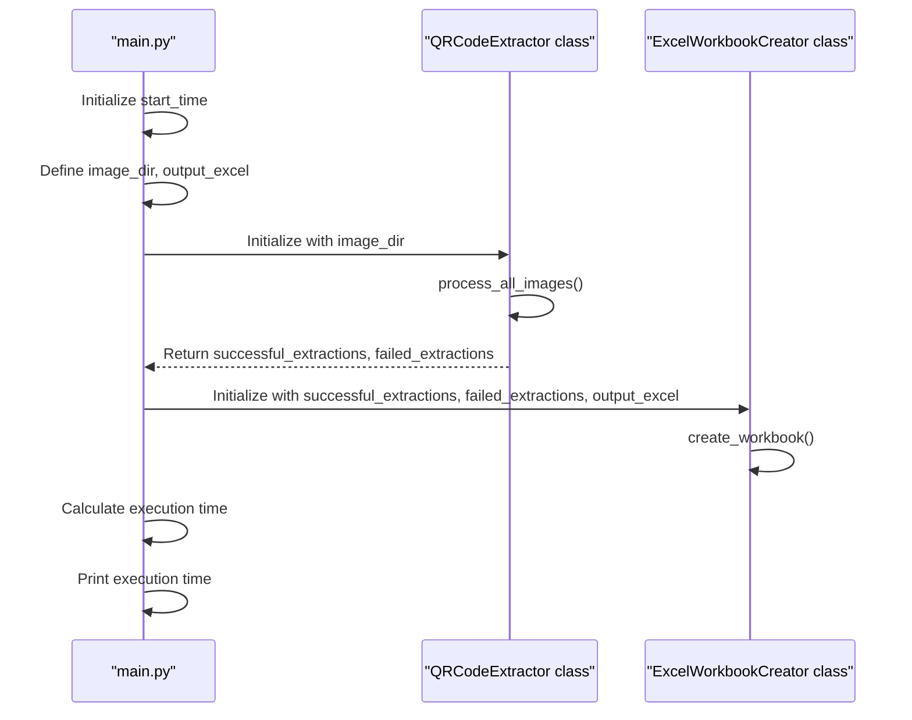
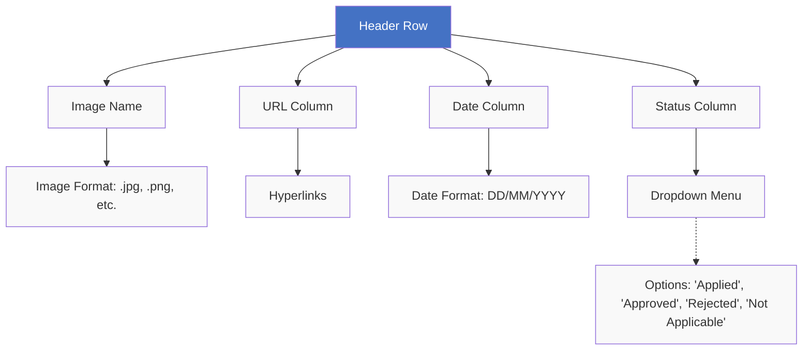
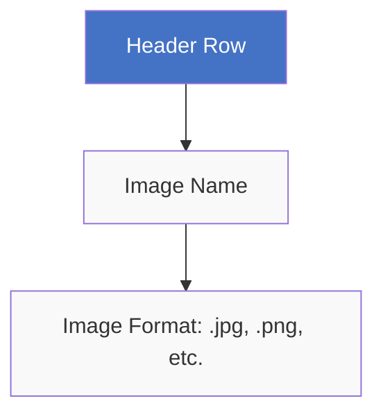

# QR Code Extractor and Excel Workbook Creator

This program extracts QR codes from images in a specified directory and outputs the results to an Excel workbook.

## How it Works

The program follows these steps:

1. Initialize the program with the directory of images and the name of the output Excel file.
2. Process all images in the directory with the `QRCodeExtractor` class.
3. Divide the results into successful and failed extractions.
4. Initialize the `ExcelWorkbookCreator` class with the successful and failed extractions and the name of the output Excel file.
5. Create an Excel workbook with two sheets: "Successful Extractions" and "Failed Extractions".
6. Populate the sheets with the respective extraction results.
7. Apply styles and formatting to the workbook.
8. Save the workbook to the output Excel file.



## Sheets Design

Successful Extractions:



Failed Extractions:



## Requirements

* Python 3.6 or higher
* openpyxl library for Excel workbook creation and manipulation
* opencv-python and pyzbar libraries for QR code extraction

```bash
pip install openpyxl opencv-python pyzbar Pillow
```

## Usage

To use this program, run the `main.py` script with Python 3.6 or higher.

```bash
python main.py
```

## Acknowledgements

This code was created with the assistance of OpenAI's GPT-4 model.
